# JMeter
API.
Нагрузочное или тестирование стабильности в основном делается на бекенд, на API сервера. Смысл состоит в том, что на сервер приходят запросы от большого количества юзеров создавая нагрузку.
RPS - (Request Per Second) это показатель работоспособности сервера, показывающий сколько запросов в секунду может обработать сервер. Стоит учитывать и сложность запросов, но если брать Smoke сценарий 
пользователя, цифра примерно должна совпадать с данными разработчиками значениями.

Начнем:
Запускаем JMeter.
Запускаем Thread Group.

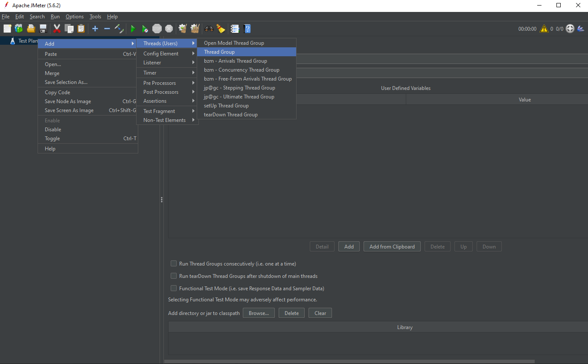

В Thread Group открываем HPPT Request.
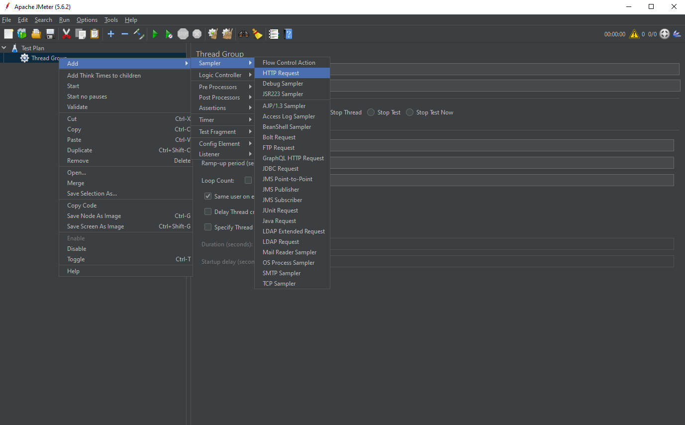

Реквест переименовываем, пишем http протокол, ip сервера, порт, метод и path в который мы указываем ендпоинт.
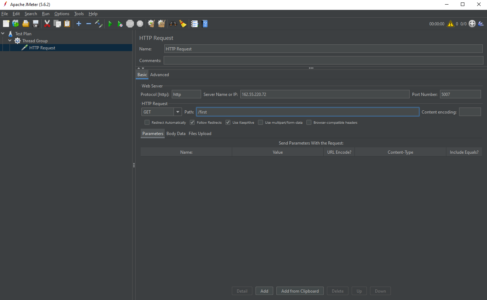
 
Наш первый реквест готов. Можно создать несколько разных или продублировать данный реквест несколько раз при желании. Каждый запущенный юзер будет запускать весь сценарий.
После создания сценариев, возвращаемся в Thread Group и настраиваем необходимые для тестирования параметры:
-Number of Threads(users) Здесь мы выставляем сколько будет запущено пользователей, которые будут выполнять наш сценарий.
-Ramp-up period (second) Период за которое время JMeter должен поднять количество пользователей.
-Loop Count Тут выставляем количество повторений всего нашего сценария тестирования. Так же можно установить бесконечное продолжение.
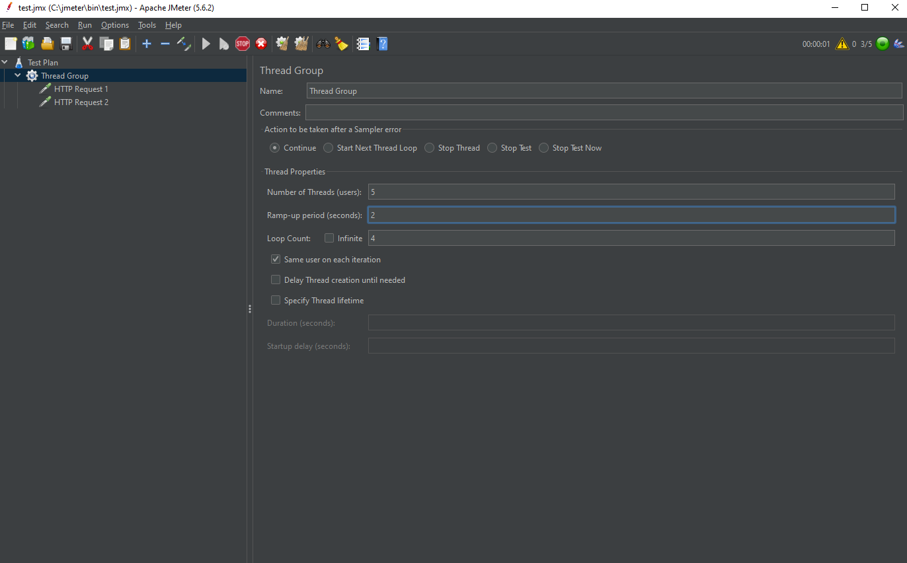
 
Далее нам нужно подключить Lisener. Довольно информативными будут View Results Tree и Summary Report.
После этого можно отправлять запрос. Всю необходимую статистику по выполнению запросов или общему прохождению теста мы можем посмотреть в данных отчетах.
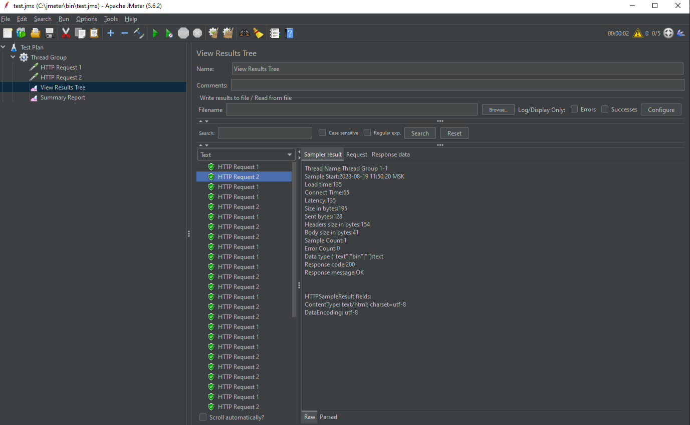
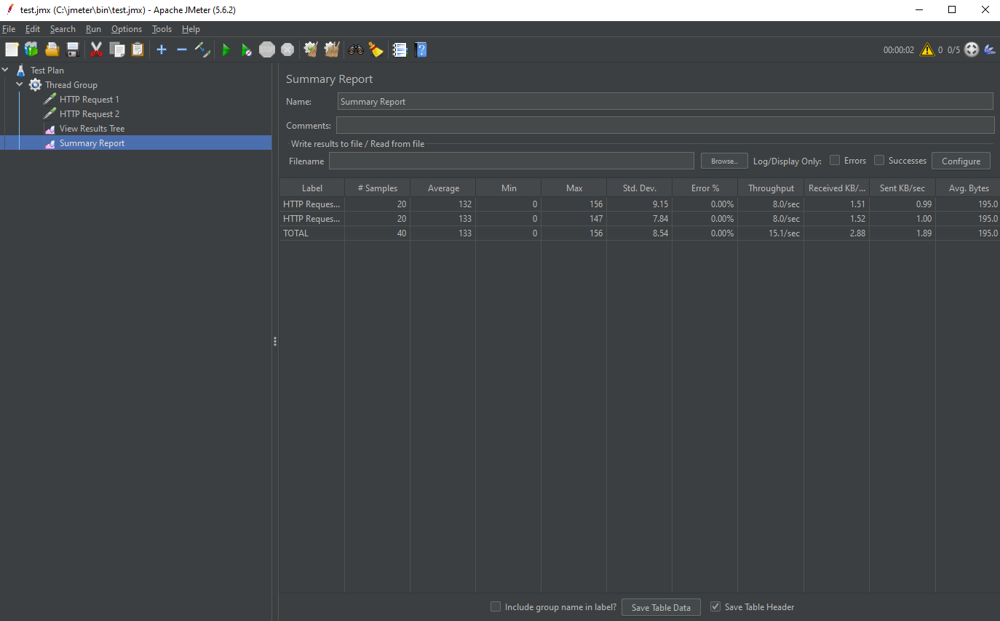
 
Стоит обращать внимание на:
-ответ от сервера (он не должен превышать максимум трех секунд),
-процент ошибок (0- идеал, не больше трех процентов- средний показатель, больше 5- проблемы которые надо устранять),
-количество ответов в минуту.
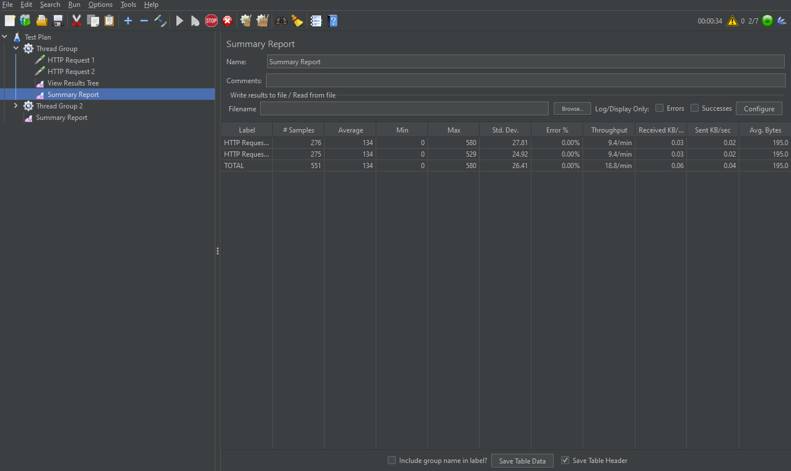

Помимо этого мы можем выбрать имя файла куда будет заноситься наш лог прохождения теста для дальнейшего анализа
или отправки.
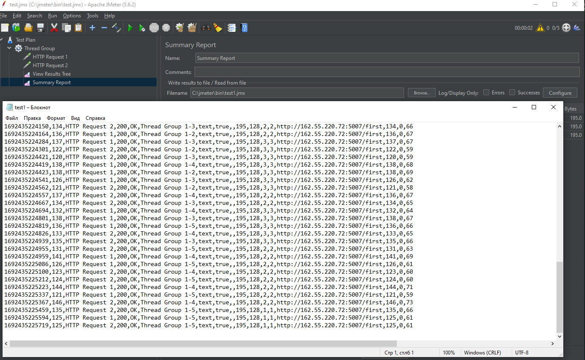

Одновеменно можно запустить одну группу пользователей по сценарию смоук теста, другие группы пользователей по другим сценариям работы нашего проекта с другими нагрузочными параметрами для
максимального приближения к реальной работе проекта. Так же при желании можно для удобства подключить HTTP Request Defaults, в котором можно вносить настройки сразу на всю группу запросов.
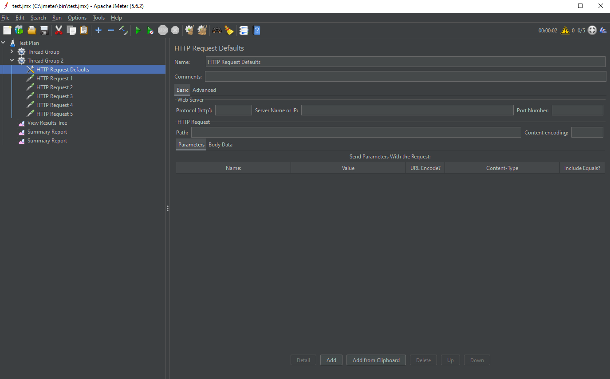

Запуская сценарий и увеличивая количество пользователей можно найти границу возможности нашего сервера, которые он способен выдержать при адекватной отработке запросов.
Если же нас интересует тестирование стабильности, то устанавливаем количество пользователей на отметке определенной нагрузки способной выдержать наш сервер и запускаем на заданный срок времени.

Установив плагин Custom Thread Groups можно более гибко установить настройки для тестирования и выставить такие параметры как:
целевой показатель, время запуска всех юзеров, количество шагов запуска , время удержания нагрузки и многое другое.
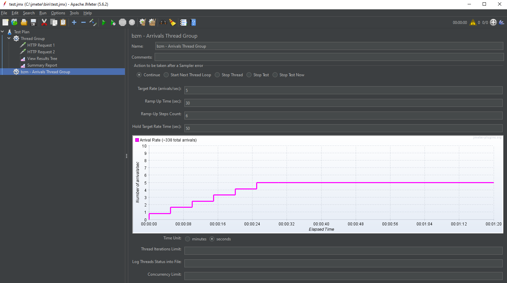

Базы данных. 
 Помимо тестирования API можно рассмотреть нагрузочное или функциональное тестирование PostgresQL базы данных. Для этого необходимо запустить JDBC Connection Configuration и внести имя и настройки подключения к базе данных. 
 
 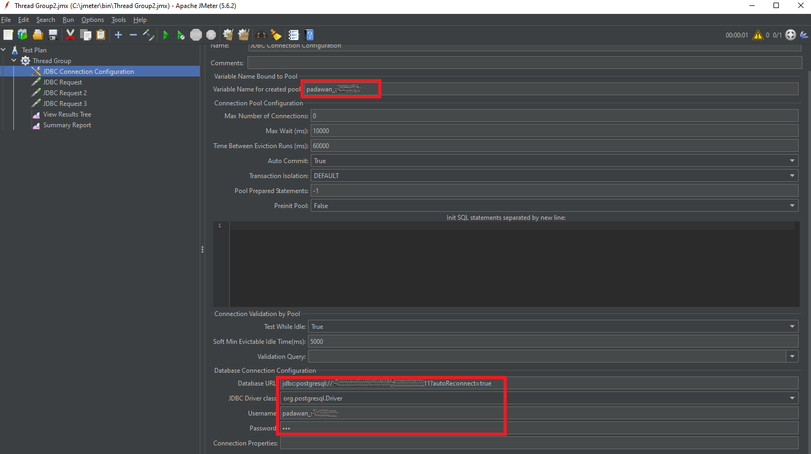
 
 Далее создаем JDBC Request и вносим в него имя и необходимый запрос.

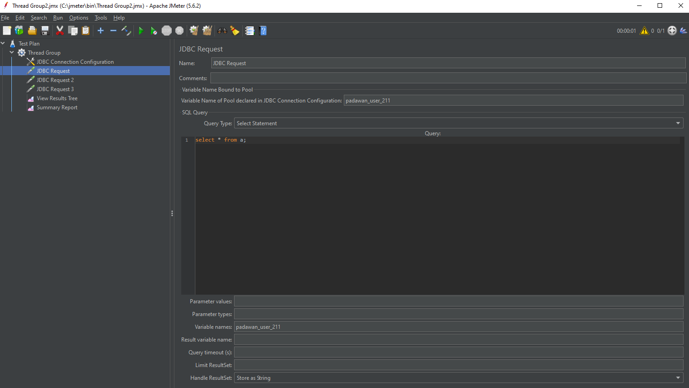

Далее в зависимости от задачи меняем настройки и проверяем.

Web site.

